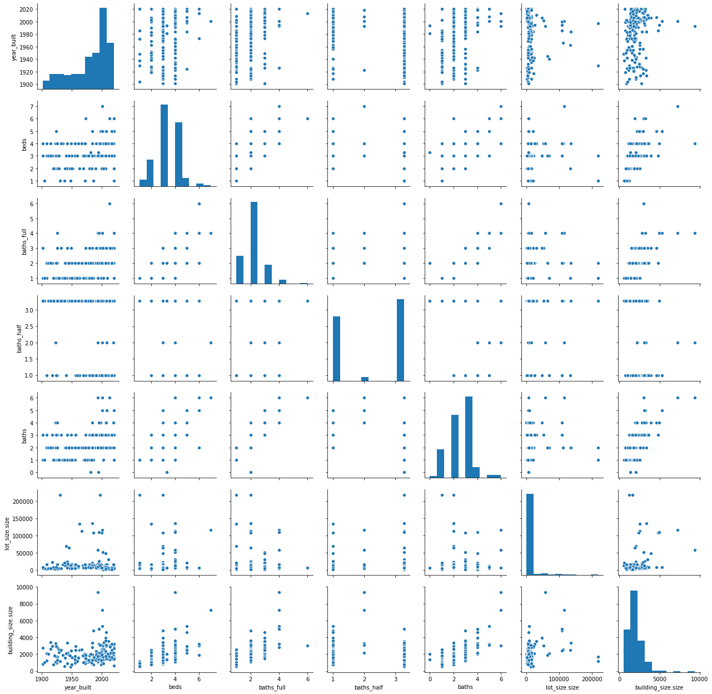

## Introduction 

Houses are all around the world. Depending on where you live, tiny apartments in one geographic region can cost as much as mansions in another region. Understanding housing prices and what factors influence these prices can be an extremely helpful asset when trying to evaluate the potential value of a home. Machine learning can be utilized by companies like real estate brokers or other large cooperation’s when buying and selling homes. This GitHub repository will evaluate how housing prices can be predicted through machine learning models by using housing and property features as well as by geographic location in the Vancouver Washington Area. 

```python
```

## Data

The data being used to determine housing prices comes from Realitor.com through Rapid API. Rapid API provides Python Requests code where the user can input variables such as city, state, area radius, and other housing factors. When applied in Python the Python Request outputs a json file. For you to use this API you will need to create a free or paid account with Rapid API to obtain an API key.

```python
import requests

url = "https://realtor.p.rapidapi.com/properties/v2/list-sold"

querystring = {"radius":"20","sort":"sold_date","city":"Vancouver","offset":"0","state_code":"WA","limit":"500"}

headers = {
    'x-rapidapi-host': "realtor.p.rapidapi.com",
    'x-rapidapi-key': " Rapid API Key"
    }

response = requests.request("GET", url, headers=headers, params=querystring)

```

To unpack this Json file you need to use a json_normalize which converts the json file into a pandas dataframe.

```python
import json
from pandas.io.json import json_normalize
import pandas as pd

response_data = json.loads(response.text)
df = json_normalize(response_data['properties'])
```

Pull out the desired housing features.

```python
buildings = df[['prop_type','year_built','beds','baths_full','garage','baths_half','price','baths','address.city','address.state','address.postal_code','address.county','lot_size.size','building_size.size']]
```

<div>

<table border="1" class="dataframe">
  <thead>
    <tr style="text-align: right;">
      <th></th>
      <th>prop_type</th>
      <th>year_built</th>
      <th>beds</th>
      <th>baths_full</th>
      <th>garage</th>
      <th>baths_half</th>
      <th>price</th>
      <th>baths</th>
      <th>address.city</th>
      <th>address.state</th>
      <th>address.postal_code</th>
      <th>address.county</th>
      <th>lot_size.size</th>
      <th>building_size.size</th>
    </tr>
  </thead>
  <tbody>
    <tr>
      <td>0</td>
      <td>condo</td>
      <td>2020.0</td>
      <td>1.0</td>
      <td>1.0</td>
      <td>NaN</td>
      <td>NaN</td>
      <td>254900</td>
      <td>1</td>
      <td>Portland</td>
      <td>Oregon</td>
      <td>97217</td>
      <td>Multnomah</td>
      <td>NaN</td>
      <td>651.0</td>
    </tr>
    <tr>
      <td>1</td>
      <td>single_family</td>
      <td>2008.0</td>
      <td>4.0</td>
      <td>2.0</td>
      <td>2</td>
      <td>1.0</td>
      <td>330000</td>
      <td>3</td>
      <td>Vancouver</td>
      <td>Washington</td>
      <td>98661</td>
      <td>Clark</td>
      <td>2614.0</td>
      <td>1558.0</td>
    </tr>
    <tr>
      <td>2</td>
      <td>single_family</td>
      <td>1995.0</td>
      <td>3.0</td>
      <td>2.0</td>
      <td>2</td>
      <td>NaN</td>
      <td>350000</td>
      <td>2</td>
      <td>Vancouver</td>
      <td>Washington</td>
      <td>98682</td>
      <td>Clark</td>
      <td>6970.0</td>
      <td>1201.0</td>
    </tr>
    <tr>
      <td>3</td>
      <td>single_family</td>
      <td>1973.0</td>
      <td>3.0</td>
      <td>1.0</td>
      <td>1</td>
      <td>NaN</td>
      <td>320000</td>
      <td>1</td>
      <td>Washougal</td>
      <td>Washington</td>
      <td>98671</td>
      <td>Clark</td>
      <td>5227.0</td>
      <td>1041.0</td>
    </tr>
    <tr>
      <td>4</td>
      <td>condo</td>
      <td>2013.0</td>
      <td>4.0</td>
      <td>3.0</td>
      <td>1</td>
      <td>NaN</td>
      <td>535000</td>
      <td>3</td>
      <td>Portland</td>
      <td>Oregon</td>
      <td>97211</td>
      <td>Multnomah</td>
      <td>2614.0</td>
      <td>2018.0</td>
    </tr>
    <tr>
      <td>...</td>
      <td>...</td>
      <td>...</td>
      <td>...</td>
      <td>...</td>
      <td>...</td>
      <td>...</td>
      <td>...</td>
      <td>...</td>
      <td>...</td>
      <td>...</td>
      <td>...</td>
      <td>...</td>
      <td>...</td>
      <td>...</td>
    </tr>
    <tr>
      <td>195</td>
      <td>single_family</td>
      <td>1923.0</td>
      <td>3.0</td>
      <td>2.0</td>
      <td>1</td>
      <td>NaN</td>
      <td>640000</td>
      <td>2</td>
      <td>Portland</td>
      <td>Oregon</td>
      <td>97211</td>
      <td>Multnomah</td>
      <td>4792.0</td>
      <td>1912.0</td>
    </tr>
    <tr>
      <td>196</td>
      <td>single_family</td>
      <td>2007.0</td>
      <td>3.0</td>
      <td>2.0</td>
      <td>1</td>
      <td>1.0</td>
      <td>430000</td>
      <td>3</td>
      <td>Portland</td>
      <td>Oregon</td>
      <td>97203</td>
      <td>Multnomah</td>
      <td>2614.0</td>
      <td>1380.0</td>
    </tr>
    <tr>
      <td>197</td>
      <td>single_family</td>
      <td>1914.0</td>
      <td>3.0</td>
      <td>2.0</td>
      <td>2</td>
      <td>NaN</td>
      <td>470000</td>
      <td>2</td>
      <td>Portland</td>
      <td>Oregon</td>
      <td>97203</td>
      <td>Multnomah</td>
      <td>4792.0</td>
      <td>1738.0</td>
    </tr>
    <tr>
      <td>198</td>
      <td>condo</td>
      <td>2004.0</td>
      <td>3.0</td>
      <td>2.0</td>
      <td>1</td>
      <td>1.0</td>
      <td>274000</td>
      <td>3</td>
      <td>Portland</td>
      <td>Oregon</td>
      <td>97233</td>
      <td>Multnomah</td>
      <td>2178.0</td>
      <td>1236.0</td>
    </tr>
    <tr>
      <td>199</td>
      <td>single_family</td>
      <td>1955.0</td>
      <td>3.0</td>
      <td>2.0</td>
      <td>NaN</td>
      <td>NaN</td>
      <td>363000</td>
      <td>2</td>
      <td>Portland</td>
      <td>Oregon</td>
      <td>97230</td>
      <td>Multnomah</td>
      <td>7405.0</td>
      <td>1080.0</td>
    </tr>
  </tbody>
</table>
<p>200 rows × 14 columns</p>
</div>

### Data Cleaning

First the data will need to be seperated by the pridicted value (y) and the features (x).

```python
X = buildings.loc[:, buildings.columns != 'price']
y = buildings['price']
X = buildings.drop(['price'], axis = 1)
```

To clean the data the means of each numeric column was taken and were inserted for all the missing values. The only column that did not have the mean applied was the garage feature because either a home has a garage or it does not.

```python
means = buildings.describe()
```

```python

X['year_built'].fillna(means.loc['mean'][0],inplace=True)
X['beds'].fillna(means.loc['mean'][1],inplace=True)
X['baths_full'].fillna(means.loc['mean'][2],inplace=True)
X['garage'].fillna(0,inplace=True)
X['baths_half'].fillna(means.loc['mean'][1],inplace=True)
X['lot_size.size'].fillna(means.loc['mean'][6],inplace=True)
X['building_size.size'].fillna(means.loc['mean'][7],inplace=True)

```

The next step for the data cleaning was to sepearte the numeric and catigorical columns. 

```python
X_num = X[X.select_dtypes(exclude='object').columns]
X_cat = X[X.select_dtypes('object').columns]
```

The categorical variables are then replaced with dummy variables to make it easier to perform data analysis.

```python
X_cat = pd.get_dummies(X_cat)

```

Once the dummy variables have been created and the numeric missing values filled with the means the dataframes are combined for a clean dataframe that can be used for data analysis.

```python
X_clean
```

<div>
<table border="1" class="dataframe">
  <thead>
    <tr style="text-align: right;">
      <th></th>
      <th>year_built</th>
      <th>beds</th>
      <th>baths_full</th>
      <th>baths_half</th>
      <th>baths</th>
      <th>lot_size.size</th>
      <th>building_size.size</th>
      <th>prop_type_condo</th>
      <th>prop_type_farm</th>
      <th>prop_type_land</th>
      <th>...</th>
      <th>address.postal_code_98665</th>
      <th>address.postal_code_98671</th>
      <th>address.postal_code_98682</th>
      <th>address.postal_code_98683</th>
      <th>address.postal_code_98684</th>
      <th>address.postal_code_98685</th>
      <th>address.postal_code_98686</th>
      <th>address.county_Clark</th>
      <th>address.county_Columbia</th>
      <th>address.county_Multnomah</th>
    </tr>
  </thead>
  <tbody>
    <tr>
      <td>0</td>
      <td>2020.0</td>
      <td>1.0</td>
      <td>1.0</td>
      <td>3.252525</td>
      <td>1</td>
      <td>15335.491713</td>
      <td>651.0</td>
      <td>1</td>
      <td>0</td>
      <td>0</td>
      <td>...</td>
      <td>0</td>
      <td>0</td>
      <td>0</td>
      <td>0</td>
      <td>0</td>
      <td>0</td>
      <td>0</td>
      <td>0</td>
      <td>0</td>
      <td>1</td>
    </tr>
    <tr>
      <td>1</td>
      <td>2008.0</td>
      <td>4.0</td>
      <td>2.0</td>
      <td>1.000000</td>
      <td>3</td>
      <td>2614.000000</td>
      <td>1558.0</td>
      <td>0</td>
      <td>0</td>
      <td>0</td>
      <td>...</td>
      <td>0</td>
      <td>0</td>
      <td>0</td>
      <td>0</td>
      <td>0</td>
      <td>0</td>
      <td>0</td>
      <td>1</td>
      <td>0</td>
      <td>0</td>
    </tr>
    <tr>
      <td>2</td>
      <td>1995.0</td>
      <td>3.0</td>
      <td>2.0</td>
      <td>3.252525</td>
      <td>2</td>
      <td>6970.000000</td>
      <td>1201.0</td>
      <td>0</td>
      <td>0</td>
      <td>0</td>
      <td>...</td>
      <td>0</td>
      <td>0</td>
      <td>1</td>
      <td>0</td>
      <td>0</td>
      <td>0</td>
      <td>0</td>
      <td>1</td>
      <td>0</td>
      <td>0</td>
    </tr>
    <tr>
      <td>3</td>
      <td>1973.0</td>
      <td>3.0</td>
      <td>1.0</td>
      <td>3.252525</td>
      <td>1</td>
      <td>5227.000000</td>
      <td>1041.0</td>
      <td>0</td>
      <td>0</td>
      <td>0</td>
      <td>...</td>
      <td>0</td>
      <td>1</td>
      <td>0</td>
      <td>0</td>
      <td>0</td>
      <td>0</td>
      <td>0</td>
      <td>1</td>
      <td>0</td>
      <td>0</td>
    </tr>
    <tr>
      <td>4</td>
      <td>2013.0</td>
      <td>4.0</td>
      <td>3.0</td>
      <td>3.252525</td>
      <td>3</td>
      <td>2614.000000</td>
      <td>2018.0</td>
      <td>1</td>
      <td>0</td>
      <td>0</td>
      <td>...</td>
      <td>0</td>
      <td>0</td>
      <td>0</td>
      <td>0</td>
      <td>0</td>
      <td>0</td>
      <td>0</td>
      <td>0</td>
      <td>0</td>
      <td>1</td>
    </tr>
    <tr>
      <td>...</td>
      <td>...</td>
      <td>...</td>
      <td>...</td>
      <td>...</td>
      <td>...</td>
      <td>...</td>
      <td>...</td>
      <td>...</td>
      <td>...</td>
      <td>...</td>
      <td>...</td>
      <td>...</td>
      <td>...</td>
      <td>...</td>
      <td>...</td>
      <td>...</td>
      <td>...</td>
      <td>...</td>
      <td>...</td>
      <td>...</td>
      <td>...</td>
    </tr>
    <tr>
      <td>195</td>
      <td>1923.0</td>
      <td>3.0</td>
      <td>2.0</td>
      <td>3.252525</td>
      <td>2</td>
      <td>4792.000000</td>
      <td>1912.0</td>
      <td>0</td>
      <td>0</td>
      <td>0</td>
      <td>...</td>
      <td>0</td>
      <td>0</td>
      <td>0</td>
      <td>0</td>
      <td>0</td>
      <td>0</td>
      <td>0</td>
      <td>0</td>
      <td>0</td>
      <td>1</td>
    </tr>
    <tr>
      <td>196</td>
      <td>2007.0</td>
      <td>3.0</td>
      <td>2.0</td>
      <td>1.000000</td>
      <td>3</td>
      <td>2614.000000</td>
      <td>1380.0</td>
      <td>0</td>
      <td>0</td>
      <td>0</td>
      <td>...</td>
      <td>0</td>
      <td>0</td>
      <td>0</td>
      <td>0</td>
      <td>0</td>
      <td>0</td>
      <td>0</td>
      <td>0</td>
      <td>0</td>
      <td>1</td>
    </tr>
    <tr>
      <td>197</td>
      <td>1914.0</td>
      <td>3.0</td>
      <td>2.0</td>
      <td>3.252525</td>
      <td>2</td>
      <td>4792.000000</td>
      <td>1738.0</td>
      <td>0</td>
      <td>0</td>
      <td>0</td>
      <td>...</td>
      <td>0</td>
      <td>0</td>
      <td>0</td>
      <td>0</td>
      <td>0</td>
      <td>0</td>
      <td>0</td>
      <td>0</td>
      <td>0</td>
      <td>1</td>
    </tr>
    <tr>
      <td>198</td>
      <td>2004.0</td>
      <td>3.0</td>
      <td>2.0</td>
      <td>1.000000</td>
      <td>3</td>
      <td>2178.000000</td>
      <td>1236.0</td>
      <td>1</td>
      <td>0</td>
      <td>0</td>
      <td>...</td>
      <td>0</td>
      <td>0</td>
      <td>0</td>
      <td>0</td>
      <td>0</td>
      <td>0</td>
      <td>0</td>
      <td>0</td>
      <td>0</td>
      <td>1</td>
    </tr>
    <tr>
      <td>199</td>
      <td>1955.0</td>
      <td>3.0</td>
      <td>2.0</td>
      <td>3.252525</td>
      <td>2</td>
      <td>7405.000000</td>
      <td>1080.0</td>
      <td>0</td>
      <td>0</td>
      <td>0</td>
      <td>...</td>
      <td>0</td>
      <td>0</td>
      <td>0</td>
      <td>0</td>
      <td>0</td>
      <td>0</td>
      <td>0</td>
      <td>0</td>
      <td>0</td>
      <td>1</td>
    </tr>
  </tbody>
</table>
<p>200 rows × 68 columns</p>
</div>

## Exploritory Data Analysis (EDA)



## Methods and Results

### Machine Learning Models:

For this project the four machine learning models used were Linear Regression, Lasso Regression, K Nearest Neighbors, and Decision Tree Regression. These four models were chosen because Linear Regression allow for basic unweighted regression. Lasso regression was used because it has weights on each variable. K Nearest Neighbors was used beacuse of its ability to use values close to eachother to find the predicted value. Decision Tree Regression was used because the predictor variables can be split to make an accurate regression model. 

To create the models the data was split into training and testing data. The machine leanring models were fit on the training data and then the training and testing data were used as predictors to see how well the model predicted home prices. 20% of the data was training data and the other 80% was testing data.

```python
X_train, X_test, y_train, y_test = train_test_split(X_clean,y, test_size=.2, random_state=42)
```
Here are the four models with the fit and predicted code for the training and testing data.
```python
Linear Regression Training                                                 Lasso Regression Trainig                                             
        
lm = LinearRegression(fit_intercept=True, normalize=False)                 lasso = Lasso(alpha=152)
lm.fit(X_train, y_train)                                                   lasso.fit(X_train, y_train)
yhat_train = lm.predict(X_train)                                           lhat_train = lasso.predict(X_train)

Linear Regression Testing                                                  Lasso Regression Testing
     
yhat_test = lm.predict(X_test)                                             lhat_test = lasso.predict(X_test)

K Nearest Neighbors Training                                                Decision Tree Regression Training 

knn = KNeighborsRegressor(n_neighbors=10)                                   regressor = DecisionTreeRegressor(min_samples_leaf=3)
knn.fit(X_train, y_train)                                                   regressor.fit(X_train, y_train)
yhat_knn_train = knn.predict(X_train)                                       rhat_train = regressor.predict(X_train)

K Nearest Neighbors Testing                                                 Decision Tree Regression Testing 

yhat_knn_test = knn.predict(X_test)                                         rhat_test = regressor.predict(X_test)

```

The two steps that were used to improve the model was introducing additional polynomial features and using a standard scaler to transform the data. After each transformation the data will need to be split into training and testing data. If the same random_state is set to the same number, the data will be the same as previous training and testing samples.

```python
        Standard Scaler                                             Polynomial Features
        
scaler = StandardScaler()                                   poly = PolynomialFeatures(2)
X_scaler = pd.DataFrame(scaler.fit_transform(X_num))        X_poly = pd.DataFrame(poly.fit_transform(X_num))
X_scaler_clean = X_scaler.join(X_cat)                       X_clean_poly = X_poly.join(X_cat)
```

The two Explanation of Model evaulation metics used were r^2 and mse. The higher r^2 the better the model predicted the data. Also, the lower the mse the better the model represented the data.

```python
                MSE Calulations                                  r^2 Caclulations
                
mse_lm_train = mean_squared_error(y_train, yhat_train)       r2_score(y_train,yhat_train)
mse_lm_test = mean_squared_error(y_test, yhat_test)          r2_score(y_test,yhat_test)
```

Each model can use this code to find the MSE and r^2 of the model. This code can also be used after the Polynomial Features and Standard Scaler.

Here are the results for each model. 

#### Linear Regression:

```python
          Origional Data                 Added Polynomial Features             Standared Scaler
          
MSE Training: 5122353784.9493885    MSE Training: 7581265325.248904     MSE Training: 5122457382.975  
MSE Testing: 12075406712.23772      MSE Testing:  34749811198.71855     MSE Testing:  8.657152201424125e+32
r^2 Training: 0.8914926508280869    r^2 Training: 0.8394052737573986    r^2 Training: 0.8914904563004126
r^2 Testing: 0.6620631983157526     r^2 Testing:  0.02750769928723762   r^2 Testing:  -2.4227509651315645e+22
```

#### Lasso Regression:

```python
          Origional Data                 Added Polynomial Features             Standared Scaler
          
MSE Training: 5175583663.522939    MSE Training: 6281078129.550999      MSE Training: 5176504163.138428
MSE Testing:  12121326679.754602   MSE Testing:  32019950426.244427     MSE Testing:  12162778030.956032
r^2 Training: 0.890365076813631    r^2 Training: 0.8669472733840091     r^2 Training: 0.8903455777752233
r^2 Testing:  0.6607781031362773   r^2 Testing:  0.10390433258309795    r^2 Testing:  0.6596180646063696
```

#### K Nearest Neighbors Regression:

```python
          Origional Data                 Added Polynomial Features             Standared Scaler
          
MSE Training: 28303747952.598625    MSE Training: 29564198618.996502     MSE Training: 20260761190.451874
MSE Testing:  32745067779.4435      MSE Testing:  33119974642.387        MSE Testing:  20226741827.94225
r^2 Training: 0.4004387844138757    r^2 Training: 0.3737385277907076     r^2 Training: 0.5708142035326385
r^2 Testing:  0.08361153044190761   r^2 Testing:  0.0731195586837885     r^2 Testing:  0.4339436670981397
```

#### Decision Tree Regression:

```python
          Origional Data                 Added Polynomial Features             Standared Scaler
          
MSE Training: 10004675362.088022    MSE Training: 10135651402.517187      MSE Training: 10004675362.088022
MSE Testing:  22251607651.870773    MSE Testing:  29453989728.833668      MSE Testing:  22243338901.870773
r^2 Training: 0.7880699287004739    r^2 Training: 0.7852954497111937      r^2 Training: 0.7880699287004739
r^2 Testing:  0.37727669954294596   r^2 Testing:  0.17571413344485154     r^2 Testing:  0.3775081049933392
```

#### Summary Of Model Performace:
The two best models from the r^2 and mse results are linear regression and lasso regression under the original unaltered data. Lasso under the standard scaler also performed well. The best model is the Lasso regression under the original unaltered data. The r^2 was high at explaining 89% of the data for the training data and explained 66% of the data for the testing data. The mse was also lower for the testing data then the training so this looks good for the model.

Overall, under Lasso regression using the original unaltered data the features used created a model that was good at determining housing prices and could be used by Real Estate or other corperations to evaluate housing prices in the Vancovuer Washington area using housing features and geographic location.

## Conclusion

Overall, for this data set the original data appeared to perform the best using the r^2 and mse evaluation metrics with Lasso Regression. Data transformations were not necessary for this data set. Some future features that would be interesting to add are adding amenities such as air conditioning (central air or window units), garden house/external storage, quality of appliances, yard condition, and etc. All of these features and other potential predictors would change the model and allow for more data analysis. However, the current Realter API does not provide this information so another API or dataset would need to be found. Another limitation was that the free API only provided 200 rows of housing data. The API would need to be upgraded to the paid subscription to receive more data lines.  
